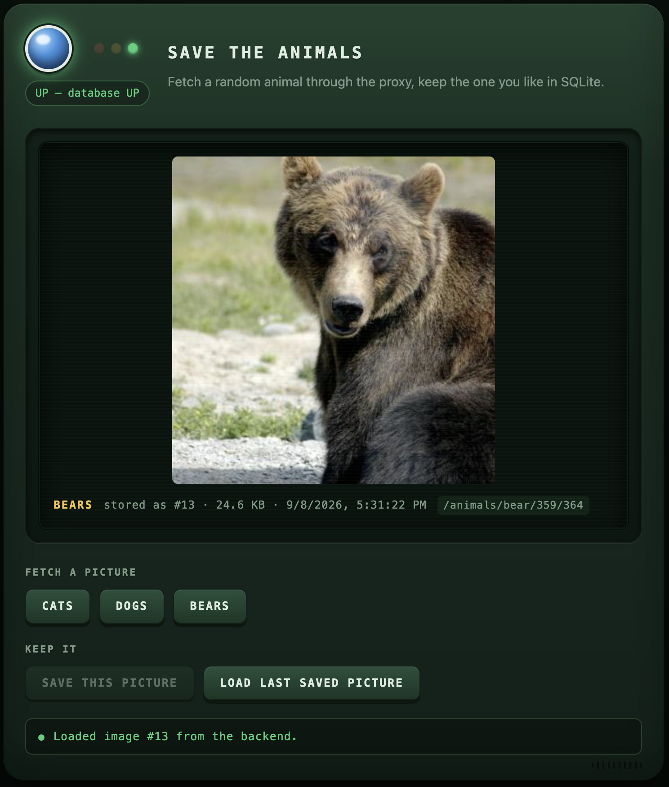

# Save the Animals



Timeboxed: 3 hours
Notes:

- No security
- No frontend tests
- No caching configured
- No ORM – hibernate might be more painful than helpful
- Controller - Service - Repository layered

Co-Developed with Claude Code Opus-5

Fetch a random cat, dog or bear through a reverse proxy, and keep the one you like in SQLite.

React (JavaScript) → Spring Boot (Java 21) → SQLite, runnable locally or as containers.

The reverse proxy is required as no CORS. NGINX is the runtime for the frontend, no separate container.

## Quick start

### Docker

```bash
docker compose up --build
```

Then go to <http://localhost:3000>.

The UI reaches the backend through the frontend's proxy.

### Locally

Prerequisites: **JDK 21**, **Node 20.19+ or 22.12+**, and Maven (or just the bundled wrapper).

```bash
# run the backend in one terminal
cd backend
JAVA_HOME=$(/usr/libexec/java_home -v 21) ./mvnw spring-boot:run

# run the frontend in another terminal. nginx not used when running locally, no need.
cd frontend
npm install
npm run dev
```

Then open <http://localhost:5173>.

## API

| Method | Path | Returns |
| --- | --- | --- |
| `GET` | `/actuator/health` | Actuator health, `db` component included |
| `POST` | `/api/images` | `201` + metadata. `multipart/form-data`: `file`, `animal`, optional `sourceUrl` |
| `GET` | `/api/images/latest` | `200` + metadata, or `404` when nothing is stored |
| `GET` | `/api/images/{id}/content` | `200` + the raw bytes, with the stored content type |

Metadata is `{ id, animal, contentType, sourceUrl, sizeBytes, createdAt }` — never the bytes.
